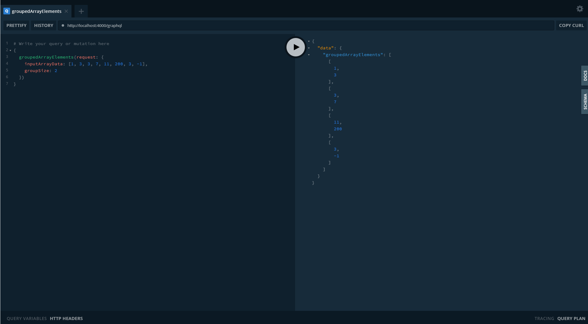

<p align="center">
  <h3 align="center">Twig Tech Test</h3>

  <p align="center">
    Twig Tech Test - Mark Campbell
  </p>
</p>

<!-- TABLE OF CONTENTS -->
<details open="open">
  <summary><h2 style="display: inline-block">Table of Contents</h2></summary>
  <ol>
    <li>
      <a href="#getting-started">Getting Started</a>
      <ul>
        <li><a href="#prerequisites">Prerequisites</a></li>
        <li><a href="#installation">Installation</a></li>
        <li><a href="#usage">Usage</a></li>
        <li><a href="#scripts">Scripts</a></li>
      </ul>
    </li>
    <li><a href="#license">License</a></li>
  </ol>
</details>

### Built With

- []() TypeScript
- []() Apollo GraphQL
- []() Express/Node

<!-- GETTING STARTED -->

## Getting Started

To get a local copy up and running follow these simple steps.

### Prerequisites

Ensure node and typescript are installed globally

### Installation

1. Clone the repo
   ```sh
   git clone https://github.com/markcdev/twig-tech-test.git
   ```
2. Install NPM packages
   ```sh
   npm install
   ```
<!-- USAGE EXAMPLES -->
## Usage

Once you are up and running, you can use the GraphQL playground to test the query like so -

 

### Scripts

#### npm run dev

Restarts the node server when files change - once this is running you can make requests from http://localhost:4000/graphql

#### npm run watch

Runs the typescript complier in watch mode

#### npm run test

Runs the unit tests with jest

## License

Distributed under the MIT License. See `LICENSE` for more information.
